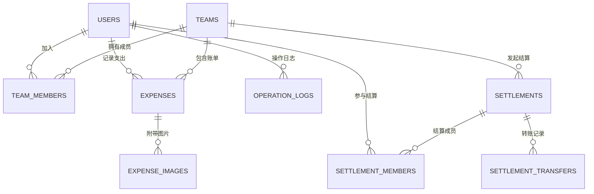
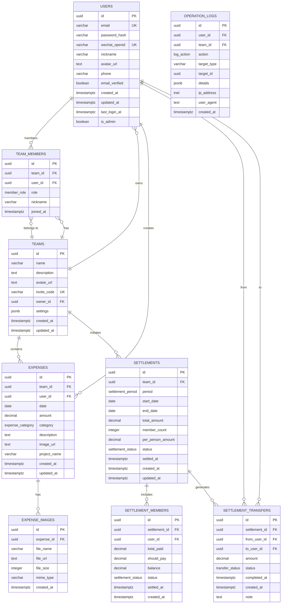
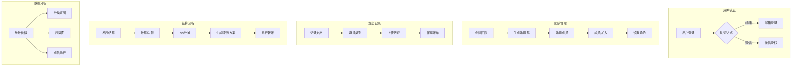
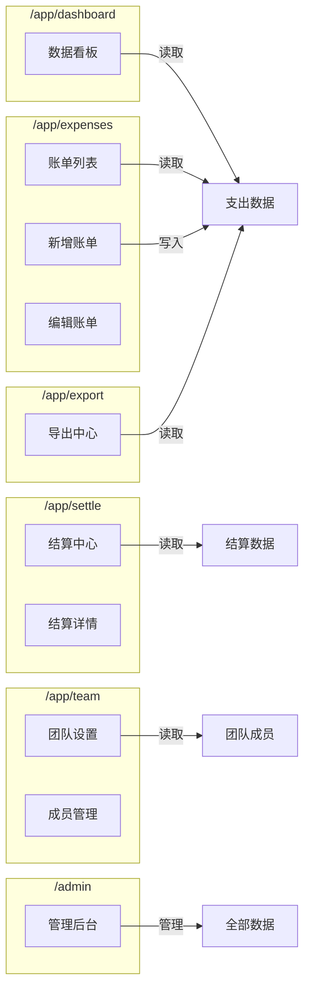

# Team Ledger - ER Diagram

## 1. 实体关系图（Mermaid格式）

### 1.1 核心实体关系



### 1.2 完整ER图



## 2. 数据流向图



## 3. 页面路由与数据关联



## 4. 枚举类型定义

```typescript
// 用户角色
type MemberRole = 'owner' | 'admin' | 'member'

// 支出类别
type ExpenseCategory = 
  | 'catering'     // 餐饮
  | 'hotel'        // 酒店
  | 'transport'    // 交通
  | 'project_cost' // 项目成本
  | 'client_entertainment' // 客户招待
  | 'advertising'  // 广告
  | 'office'       // 办公
  | 'other'        // 其它

// 结算状态
type SettlementStatus = 'pending' | 'partially_paid' | 'settled'

// 结算周期
type SettlementPeriod = 'weekly' | 'monthly' | 'custom'

// 转账状态
type TransferStatus = 'pending' | 'completed' | 'cancelled'

// 操作类型
type LogAction = 
  | 'create' 
  | 'update' 
  | 'delete' 
  | 'login' 
  | 'logout' 
  | 'invite' 
  | 'join' 
  | 'leave' 
  | 'kick' 
  | 'transfer'
```

## 5. 数据库索引概览

| 表名 | 索引类型 | 索引字段 |
|------|---------|---------|
| users | UNIQUE | email |
| users | UNIQUE | wechat_openid |
| teams | UNIQUE | invite_code |
| teams | INDEX | owner_id |
| team_members | UNIQUE | (team_id, user_id) |
| team_members | INDEX | team_id |
| team_members | INDEX | user_id |
| expenses | INDEX | team_id, date |
| expenses | INDEX | user_id |
| expenses | INDEX | category |
| expenses | INDEX | project_name |
| settlements | INDEX | team_id |
| settlements | INDEX | status |
| operation_logs | INDEX | created_at DESC |
| operation_logs | INDEX | user_id |
| operation_logs | INDEX | team_id |